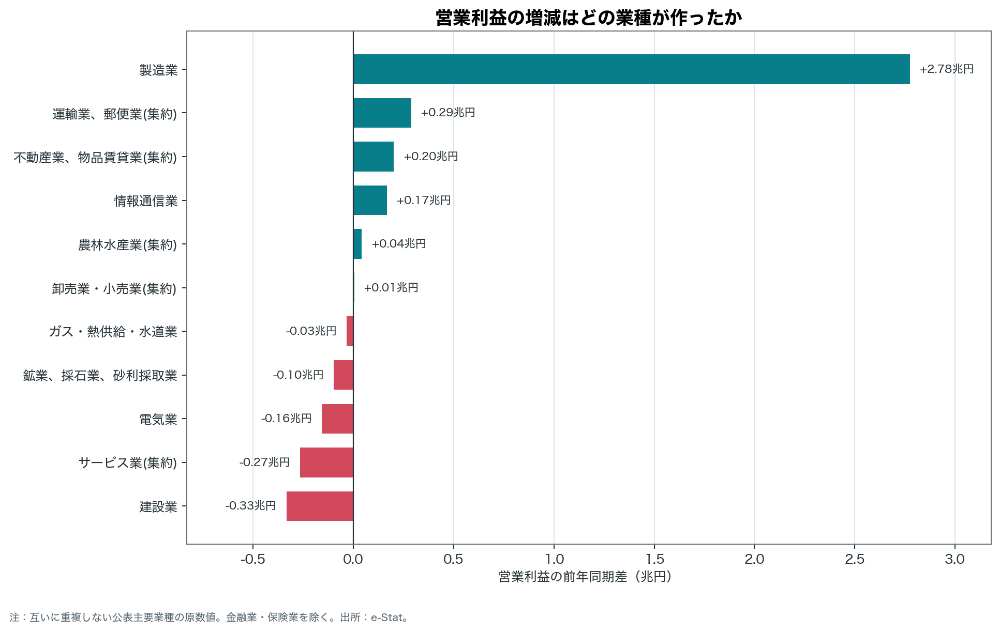
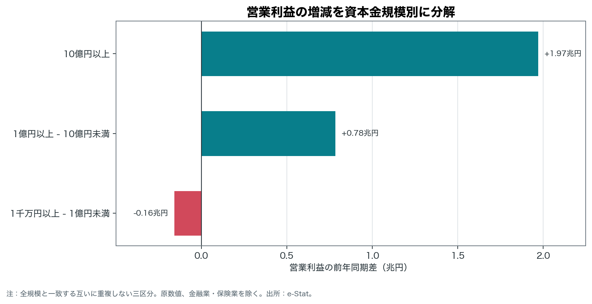
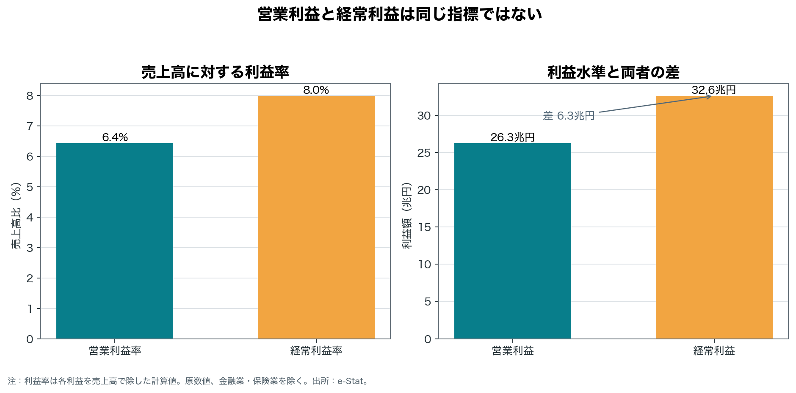
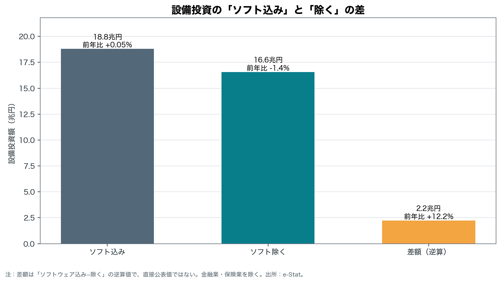
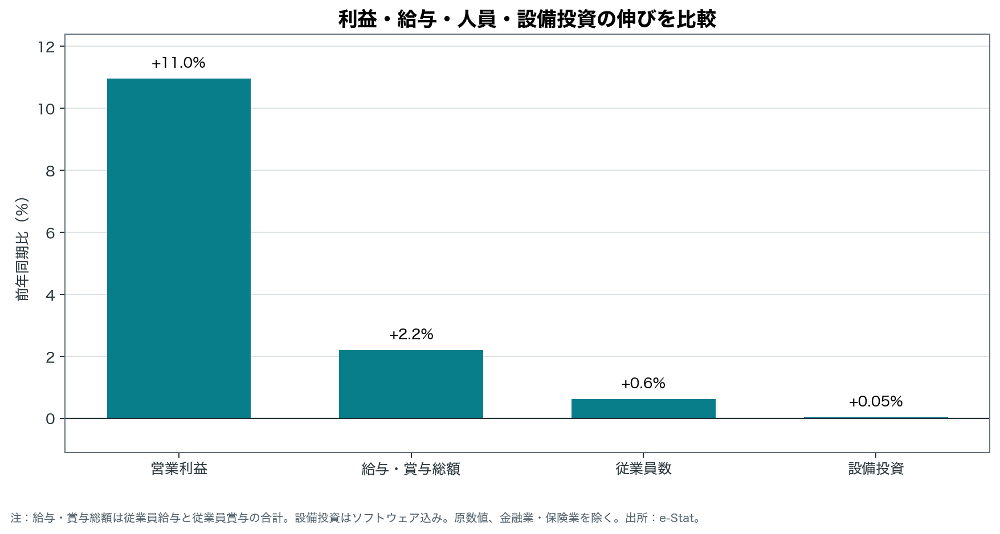

# 法人企業統計から読む企業部門の増益と配分 — 令和8年1〜3月期

**STATUS: PASS**

【FACT】調査対象は、日本に本店を持つ資本金・出資金・基金が一千万円以上の営利法人等を母集団とする標本調査である。本文の主系列は金融業・保険業を除く全規模・全産業。金融業・保険業込みの全産業系列は別表として扱い、その経常利益は37.1兆円<!-- claim: C-037 -->である。

表記は【FACT】が構造化データまたは公表注記、【CALC】がそれらからの計算、【HYPOTHESIS】が外部一次資料による追加検証を要する解釈を示す。

## 事実だけによる200字要約

【FACT】主系列は金融業・保険業を除く。【FACT】売上高は408.7兆円<!-- claim: C-001 -->。【CALC】前年差4.4兆円<!-- claim: C-002 -->、前年同期比+1.1%<!-- claim: C-003 -->。【FACT】営業利益は26.3兆円<!-- claim: C-004 -->。【CALC】前年差2.6兆円<!-- claim: C-005 -->、同+11.0%<!-- claim: C-006 -->。【FACT】経常利益は32.6兆円<!-- claim: C-007 -->。【CALC】前年差4.2兆円<!-- claim: C-008 -->、同+14.6%<!-- claim: C-009 -->。【FACT】設備投資（ソフトウェア込み）は18.8兆円<!-- claim: C-010 -->。【CALC】前年差89億円<!-- claim: C-011 -->、同+0.05%<!-- claim: C-012 -->。増減率は前年同期との比較であり、各金額は全て季節調整前の名目値で、対象値はいずれも全規模合計の母集団推計値である。

## 最も重要な独自発見三点

- 【CALC】営業利益の最大の押し上げは製造業で、前年差は2.8兆円<!-- claim: C-018 -->、全体の純増への寄与率は106.9%<!-- claim: C-019 -->。正の増益寄与に占める集中度は、上位一業種79.7%<!-- claim: C-020 -->、上位三業種93.8%<!-- claim: C-021 -->、上位五業種99.8%<!-- claim: C-022 -->だった。最大業種の寄与が全体純増を上回るのは、他業種の減益が一部を相殺したためである。

- 【CALC】資本金規模別では十億円以上区分の営業利益前年差が2.0兆円<!-- claim: C-023 -->で、全規模の純増に対する寄与率は75.9%<!-- claim: C-024 -->。増益は規模別に均等ではない。

- 【CALC】経常利益と営業利益の水準差は6.3兆円<!-- claim: C-025 -->、両利益の前年差の差は1.6兆円<!-- claim: C-026 -->。営業外損益等を含む経常利益と営業利益を分けて読む必要がある。

## 図表でみる増減額と集中



業種別寄与率は各業種の前年差を全産業の純増減で除した値である。純増が小さい場合や、増益業種と減益業種が相殺する場合は、寄与率が直感より大きくなる。



## 営業利益と経常利益

【CALC】売上高営業利益率は6.4%<!-- claim: C-027 -->、売上高経常利益率は8.0%<!-- claim: C-028 -->。後者には営業外損益等が入るため、両者の差は本業だけの説明には使えない。



## ソフトウェア込み・除く設備投資

【CALC】ソフトウェア投資額の逆算値は2.2兆円<!-- claim: C-029 -->、前年同期比は+12.2%<!-- claim: C-030 -->。これは設備投資のソフトウェア込み系列から除く系列を差し引いた値で、独立した直接公表系列ではない。



季節調整済み前期比は原数値の前年同期比とは別系列である。

| 項目 | 【CALC】季節調整済み前期比 |
|---|---:|
| 売上高 | +1.3%<!-- claim: C-013 --> |
| 営業利益 | +7.6%<!-- claim: C-014 --> |
| 経常利益 | +4.1%<!-- claim: C-015 --> |
| 設備投資（ソフトウェア除く） | -3.5%<!-- claim: C-016 --> |
| 設備投資（ソフトウェア込み） | -2.0%<!-- claim: C-017 --> |

## 利益・給与・人員・設備投資の配分



【CALC】給与・賞与総額の前年同期比は+2.2%<!-- claim: C-035 -->、従業員数の前年同期比は+0.6%<!-- claim: C-036 -->。

【CALC】従業員一人当たり給与総額の四半期概算は116.0万円/人<!-- claim: C-031 -->。同じ企業部門の資金面では、現預金の前年差が10.8兆円<!-- claim: C-032 -->、借入金合計の前年差が41.9兆円<!-- claim: C-033 -->、支払利息等の前年差が6,760億円<!-- claim: C-034 -->だった。

図は営業利益、給与・賞与総額、従業員数、ソフトウェア込み設備投資の前年同期比を同じ尺度に置く。伸び率の差は配分の同時変化を示すが、企業ごとの配分判断や因果を直接示すものではない。

## 解釈上の限界

- 金額は名目値であり、物価変動を除いた実質値ではない。「過去最高」の判定は本分析では行わない。

- 標本調査から母集団を推計した四半期の仮決算計数であり、後日の改訂、標本誤差、季節性の影響を受ける。

- 業種・規模別寄与は算術的な分解であり、需要、価格、為替、コストなどの原因を識別しない。純増減がゼロに近いと寄与率は不安定になる。

- 上位業種の集中度は、重複しない公表主要業種の区分粒度に依存し、製造業は大区分のまま扱う。

- ソフトウェア投資は二系列の差額による逆算で、公表値の丸めや表章変更の影響を受ける。欠損時は計算せず、ゼロで補完しない。

- 一人当たり給与総額は四半期の給与・賞与総額を期末従業員数で除した概算で、個人の月給や可処分所得ではない。

- 金融業・保険業込み表と除く表では利用できる項目が異なる。本文の売上高、営業利益、寄与分析に両範囲を混在させていない。

## 使用データと再現方法

対象公表は財務省「四半期別法人企業統計調査」令和8年1〜3月期、公開日は 2026-06-01。数値の正本は e-Stat の構造化データ、公表 PDF は定義・注記・ランキングの照合、財務省 Excel は公表増減率の照合に使った。

取得 URL、取得日時、表番号、公開日、SHA-256 は `data_manifest.json` に保存している。raw ファイルは取得時のバイト列を変更せず、処理後データと記事は次のコマンドで再生成できる。

```bash
make run RELEASE=2026Q1
```

計算式、フィルター、出所、表示値は `claims.csv`、検証結果と表章・分類・欠損ログは `audit_report.md` を参照されたい。

## 外部資料で追加検証すべき仮説

- 【HYPOTHESIS】製造業の増益にAI関連需要が関与した可能性。企業の受注・販売・投資家向け一次資料で確認が必要。<!-- claim: H-067 -->

- 【HYPOTHESIS】サービス業の減益に人件費・人手不足・価格転嫁の差が関与した可能性。業種別の一次資料で確認が必要。<!-- claim: H-068 -->

- 【HYPOTHESIS】宿泊・飲食関連の動きにインバウンド需要が関与した可能性。観光庁等の一次統計で確認が必要。<!-- claim: H-069 -->
