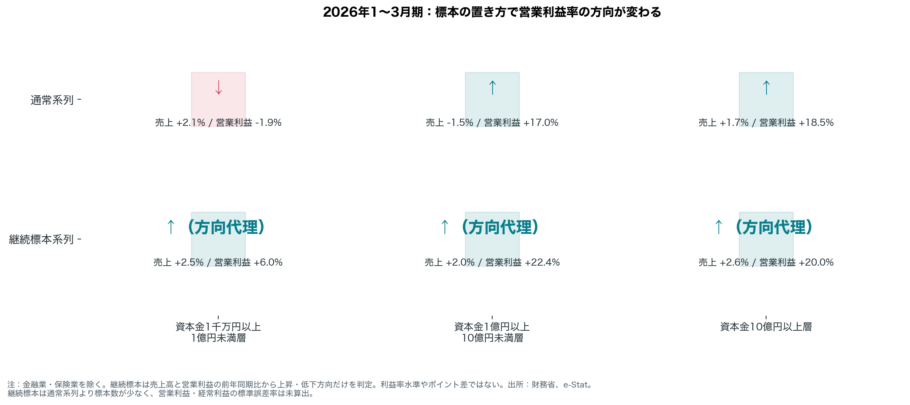
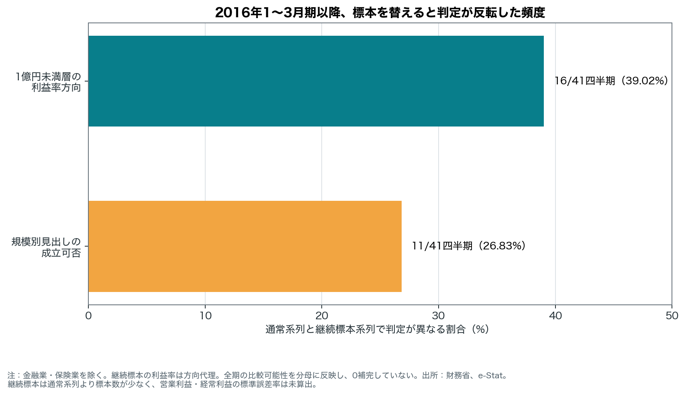

# 標本を替えると、利益率の方向は反転した

<!-- central-candidate: SAMPLE_CONSTRUCTION_SENSITIVITY -->
<!-- central-claim: V3-CURRENT-HEADLINE-REVERSAL -->
<!-- article-mode: SAMPLE_CONSTRUCTION_SENSITIVITY_ONLY -->

## 事実だけによる200字要約

令和八年一～三月期、通常系列では資本金1千万円以上1億円未満層の売上高は2.1％<!-- claim: V3-MAIN-CAP19-SALES-YOY -->増、営業利益は1.9％<!-- claim: V3-MAIN-CAP19-OPERATING-PROFIT-YOY -->減で、営業利益率は低下<!-- claim: V3-MAIN-CAP19-MARGIN-DIRECTION -->した。一方、同じ層の継続標本系列では売上高2.5％<!-- claim: V3-CONT-CAP19-SALES-YOY -->増、営業利益6.0％<!-- claim: V3-CONT-CAP19-OPERATING-PROFIT-YOY -->増となり、利益率は上昇方向<!-- claim: V3-CONT-CAP19-MARGIN-DIRECTION -->だった。通常系列の同層見出しは、継続標本へ替えると成立しない<!-- claim: V3-CURRENT-HEADLINE-REVERSAL -->。継続標本は通常系列より標本数が少なく<!-- claim: V3-CONT-SMALLER-SAMPLE -->、売上高と設備投資以外の標準誤差率は公表資料で計算されていないとの公式注記がある<!-- claim: V3-CONT-PROFIT-SE-NOT-CALCULATED -->。

## 調査対象と結論

調査対象は、財務省「法人企業統計調査・四半期別調査」の法人企業で、ここでは金融業・保険業を除く。結論は一つだ。同じ対象期でも、通常系列から継続標本系列へ替えると、この規模別見出しの成立可否が反転する<!-- claim: V3-CURRENT-HEADLINE-REVERSAL -->。

通常系列は利益と売上高の水準から方向を確認した。継続標本系列は利益率水準も前年差ポイントも示さず、売上高前年同期比と営業利益前年同期比から作った上昇・低下の方向代理だけを使った<!-- claim: V3-CONT-CAP19-MARGIN-DIRECTION -->。

## 長期でも無視できない反転頻度

規模別見出しの成立可否は11/41四半期（26.83％）<!-- claim: V3-HEADLINE-REVERSAL-FREQUENCY -->で異なった。資本金1千万円以上1億円未満層の利益率方向だけでは16/41四半期（39.02％）<!-- claim: V3-SMALL-MARGIN-REVERSAL-FREQUENCY -->で反転した。これは原因の推定ではなく、標本構成に対する見出しの感度を記述したものだ。

## 解釈上の限界

継続標本は通常系列より標本数が少ない<!-- claim: V3-CONT-SMALLER-SAMPLE -->。また、公表資料では営業利益と経常利益の標準誤差率は算出されていない<!-- claim: V3-CONT-PROFIT-SE-NOT-CALCULATED -->。したがって、反転の頻度は不確実性を解消するものではない。また、統計だけから企業行動の原因は断定しない。

## 使用データと再現方法

数値の正本は e-Stat 表1と財務省の継続標本参考系列 `keizoku.pdf` である。取得物はハッシュ付きで凍結し、`build_continuing_sample_analysis()` から `build_claims_v3()`、`build_stage3_charts()` の順に再計算する。本文の数値は `claims_v3.csv` の PASS 行と明示的な claim ID で紐付ける。

## 外部資料で追加検証すべき仮説

【HYPOTHESIS】通常系列と継続標本系列の差が、標本の入れ替わり、ウェイト、企業構成のどれと関連するかは本統計だけでは分からない。財務省の標本設計資料と追加の公式集計で別途検証する必要がある。
