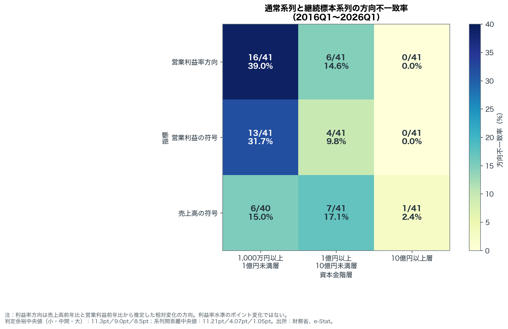
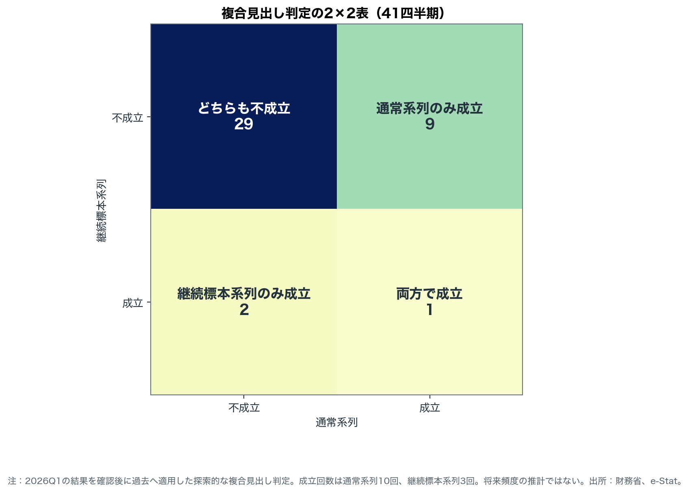
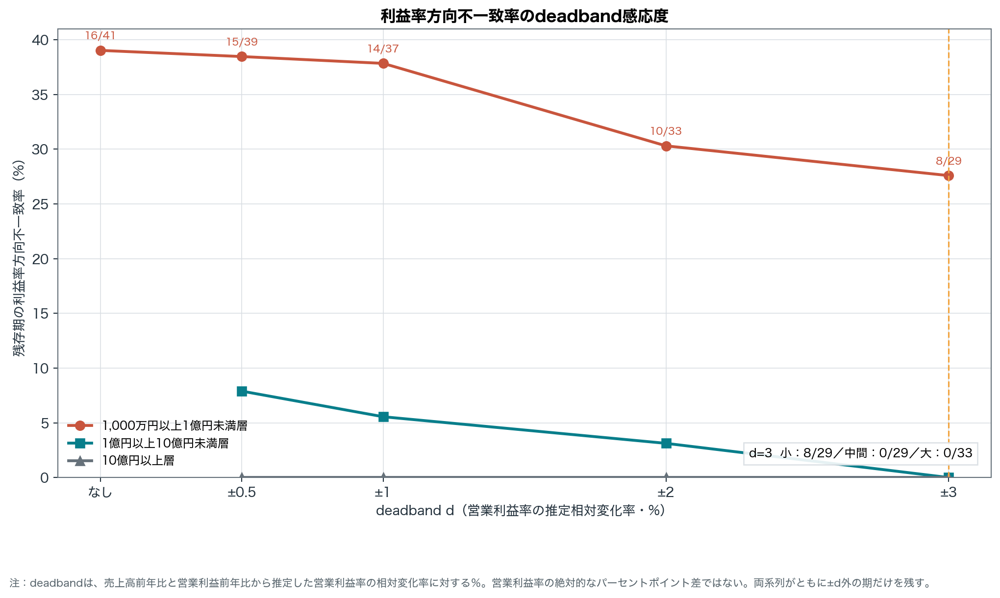

# 利益率方向の食い違いは小規模資本金層に集中していた――法人企業統計、二つの推計を41四半期比べる <!-- central-claim: V31-SMALL-MARGIN-DIRECTION-MISMATCH --> <!-- claim: V31-SMALL-MARGIN-DIRECTION-MISMATCH -->

## 発端は2026年1～3月期 <!-- claim: V32-2026Q1-SMALL-REGULAR-SALES-YOY -->

対象は資本金1,000万円以上1億円未満層である。<!-- claim: V32-2026Q1-SMALL-REGULAR-SALES-YOY -->2026年1～3月期、通常系列は売上高＋2.1％<!-- claim: V32-2026Q1-SMALL-REGULAR-SALES-YOY -->、営業利益－1.9％<!-- claim: V32-2026Q1-SMALL-REGULAR-OPERATING-PROFIT-YOY -->、継続標本系列は売上高＋2.5％<!-- claim: V32-2026Q1-SMALL-CONTINUING-SALES-YOY -->、営業利益＋6.0％<!-- claim: V32-2026Q1-SMALL-CONTINUING-OPERATING-PROFIT-YOY -->だった。売上高はいずれの系列でも増加したが、営業利益の増減方向は通常系列で減少、継続標本系列で増加と分かれ、推定する営業利益率の方向も低下と上昇に分かれた。系列間の絶対差は売上高0.4ポイント<!-- claim: V32-2026Q1-SMALL-SALES-CROSS-SERIES-GAP -->、営業利益7.9ポイント<!-- claim: V32-2026Q1-SMALL-OPERATING-PROFIT-CROSS-SERIES-GAP -->である。この一例を起点に、比較可能な過去41四半期へ確認を広げた。<!-- claim: V31-SMALL-MARGIN-DIRECTION-MISMATCH -->

## 要旨

財務省の法人企業統計には、各期の通常系列と、回答を継続した企業を用いる継続標本系列がある。以後、冒頭で定義した資本金階層を「小規模資本金層」と記す。両系列を並べると、小規模資本金層の営業利益率の上昇・低下方向は16/41（39.0％）で食い違った。<!-- claim: V31-SMALL-MARGIN-DIRECTION-MISMATCH -->この記事の主張は、この方向不一致が資本金階層間で均等ではなく、営業利益と利益率方向では小規模資本金層に集中して観察された、という一点である。

ただし、これは将来の頻度を示す評価ではない。16/41<!-- claim: V31-SMALL-MARGIN-DIRECTION-MISMATCH -->と11/41<!-- claim: V31-COMPOSITE-HEADLINE-MISMATCH -->はいずれも、対象期の結果を見た後に過去へ適用した探索的バックテストである。後者は複数条件を組み合わせた見出しの成立可否であり、本文の主数値ではなく補足に置く。

## 何を比べたのか

通常系列と継続標本系列は、単に同じ真値を異なる標本で測った二つの推計とは限らない。標本の入れ替え、継続回答法人への限定、推計用乗率、未回答補完、企業の参入・退出、母集団構成の違いを含み得る。また、増資や減資によって同じ企業が資本金階層間を移る可能性もある。これは分類移動の一般的な説明であり、今回観察した差の原因を特定するものではない。どちらの系列も真実や正解とは呼ばない。片方を基準にもう片方の優劣を決める比較ではなく、見出しの感応度を系列の構成差とともに記述する作業である。

継続標本では営業利益率水準が公表されていない。そこで、売上高前年比と営業利益前年比から推定した利益率の相対変化率（％）の符号だけを使い、上昇・低下の方向判定だけに限定した。「何ポイント変化した」という比較は行っていない。通常系列にも同じ変換を適用し、同じ定義で並べた。

最初の図の利益率方向を見ると、不一致は小規模資本金層で16/41（39.0％）<!-- claim: V31-SMALL-MARGIN-DIRECTION-MISMATCH -->、中間資本金層で6/41（14.6％）<!-- claim: V31-MISMATCH-MIDDLE-MARGIN-DIRECTION -->、大規模資本金層で0/41（0.0％）<!-- claim: V31-MISMATCH-LARGE-MARGIN-DIRECTION -->だった。

利益率方向だけの現象でもない。営業利益前年比の符号不一致率は、小規模31.7％<!-- claim: V31-MISMATCH-SMALL-OPERATING-PROFIT -->、中間9.8％<!-- claim: V31-MISMATCH-MIDDLE-OPERATING-PROFIT -->、大規模0.0％<!-- claim: V31-MISMATCH-LARGE-OPERATING-PROFIT -->だった。売上高前年比の符号不一致率は、小規模15.0％<!-- claim: V31-MISMATCH-SMALL-SALES -->、中間17.1％<!-- claim: V31-MISMATCH-MIDDLE-SALES -->、大規模2.4％<!-- claim: V31-MISMATCH-LARGE-SALES -->である。売上高では中間が小規模をわずかに上回る。したがって図全体ではなく、営業利益と利益率方向に限って小規模側への集中を述べる。

## 変化幅だけでは説明できない

大規模資本金層の一致を「変化幅が大きいから」と説明できるかも確認した。継続標本について、判定余裕を営業利益増加率と売上高増加率の差の絶対値と定義すると、中央値は小規模11.3ポイント<!-- claim: V31-SMALL-DECISION-MARGIN-MEDIAN -->、中間9.0ポイント<!-- claim: V31-MIDDLE-DECISION-MARGIN-MEDIAN -->、大規模8.5ポイント<!-- claim: V31-LARGE-DECISION-MARGIN-MEDIAN -->だった。増加率同士の差なので、単位は％ではなくポイントである。大規模の判定余裕が最大だったわけではない。

両系列の「営業利益前年比－売上高前年比」の差を取り、その絶対値の中央値を見ると、小規模11.21ポイント<!-- claim: V31-SMALL-SERIES-DIVERGENCE-MEDIAN -->、中間4.07ポイント<!-- claim: V31-MIDDLE-SERIES-DIVERGENCE-MEDIAN -->、大規模1.05ポイント<!-- claim: V31-LARGE-SERIES-DIVERGENCE-MEDIAN -->だった。系列間の乖離そのものが小規模側で大きい。この結果からは「大企業は変化幅が大きいから一致する」という説明は支持されないが、別の仕組みを原因として特定するものでもない。

通常系列では、非金融法人について資本金5億円未満を標本抽出し半数をローテーションする一方、同額以上は全数選定でローテーションしない。<!-- claim: V31-CENSUS-THRESHOLD -->中間資本金層はこの境界をまたぐ。資本金階層別の不一致勾配は調査設計と整合的である。ただし、全数か標本かだけで結果が決まるとはいえない。継続回答条件や乗率、補完、母集団構成、階層間移動も同時に異なり得るからだ。

## 複合見出しの成立区分

「大規模資本金層は利益率が改善し、小規模資本金層は悪化する」という複合見出しは、通常系列だけで9回<!-- claim: V31-HEADLINE-2X2-REGULAR-ONLY -->、継続標本系列だけで2回<!-- claim: V31-HEADLINE-2X2-CONTINUING-ONLY -->、両方で1回<!-- claim: V31-HEADLINE-2X2-BOTH -->成立し、どちらでも成立しなかったのが29回<!-- claim: V31-HEADLINE-2X2-NEITHER -->だった。成立回数を系列別に足すと通常系列10回<!-- claim: V31-HEADLINE-REGULAR-TOTAL -->、継続標本系列3回<!-- claim: V31-HEADLINE-CONTINUING-TOTAL -->となる。これは成立区分にみられる非対称の記述であり、通常系列の調査上の失敗を意味しない。

系列間でこの見出しの成立可否が違ったのは11/41四半期<!-- claim: V31-COMPOSITE-HEADLINE-MISMATCH -->である。ただし、これは三つの条件を束ねた補足指標だ。異なる尺度を一つの複合数値へ混ぜず、条件を満たしたか否かだけを数えた。主結果はあくまで利益率方向そのものの16/41<!-- claim: V31-SMALL-MARGIN-DIRECTION-MISMATCH -->である。

## 二つの頑健性確認

第一は公表値の丸めに対する感応度である。継続標本の売上高前年比と営業利益前年比の各公表値に±0.05ポイント<!-- claim: V31-ROUNDING-HALF-WIDTH -->の区間を置き、両者の差の絶対値が0.1ポイント<!-- claim: V31-ROUNDING-AMBIGUITY-THRESHOLD -->以下なら、表示丸めだけでは方向を決められない扱いとした。該当は0件<!-- claim: V31-ROUNDING-AMBIGUOUS-COUNT -->で、最小の判定余裕は2018Q2の0.5ポイント<!-- claim: V31-ROUNDING-MINIMUM-MARGIN -->だった。これは表示丸めに限った確認であり、標本誤差は別途未定量である。

第二はdeadbandである。両系列の推定変化がともに±dの外側にある四半期だけを残した。単位は営業利益率の絶対ポイント差ではなく、売上高前年比と営業利益前年比から推定した利益率の相対変化率（％）である。

小規模資本金層は、±0.5％で15/39<!-- claim: V31-DEADBAND-SMALL-D005 -->、±1％で14/37<!-- claim: V31-DEADBAND-SMALL-D010 -->、±2％で10/33<!-- claim: V31-DEADBAND-SMALL-D020 -->、±3％で8/29<!-- claim: V31-DEADBAND-SMALL-D030 -->となった。最後の閾値では不一致率が小規模27.6％<!-- claim: V31-DEADBAND-SMALL-D030 -->、中間0.0％<!-- claim: V31-DEADBAND-MIDDLE-D030 -->、大規模0.0％<!-- claim: V31-DEADBAND-LARGE-D030 -->で、小規模側の食い違いが残る。閾値を動かしても階層差が消える形ではなかったが、閾値は分析者が置いた感応度設定である。

さらに、継続標本の営業利益増加率の絶対値が100％<!-- claim: V31-EXTREME-YOY-THRESHOLD -->を超えた3件<!-- claim: V31-EXTREME-YOY-FLAGGED -->へ機械的レビュー印を付けた。名称にかかわらず低ベースやゼロ近傍を示す証拠とは扱わず、その全てが方向不一致ではなかった。<!-- claim: V31-EXTREME-YOY-MISMATCH -->歴史窓の分母を41四半期<!-- claim: V31-SMALL-MARGIN-DIRECTION-MISMATCH -->に固定した帰属確認では、利益率方向16/41<!-- claim: V31-SMALL-MARGIN-DIRECTION-MISMATCH -->と複合見出し11/41<!-- claim: V31-COMPOSITE-HEADLINE-MISMATCH -->の件数は変わらない。これは分母を減らす完全ケース再推計ではない。

## 読み方の限界

継続標本は通常系列より標本数が小さく、営業利益・経常利益の標準誤差率が算出されていない。このため、ここで示した差について標本誤差を数値化して比較することはできない。丸め感応度で判定不能がなかったことと、未定量の標本誤差とは別問題である。

また、継続標本は固定された企業集合を無条件に追跡する資料ではない。回答の継続、企業の状態変化、集計対象の条件を踏まえる必要がある。通常系列はその時点の母集団を表すための推計であり、継続標本系列は継続回答企業の動きを確認する補助資料である。それぞれの目的が違う以上、系列間の食い違いを一方の欠陥へ置き換えない。

以上から公開記事で採用する主張は一つに限る。法人企業統計の利益率方向の食い違いは、観察した41四半期では小規模資本金層に集中していた。<!-- claim: V31-SMALL-MARGIN-DIRECTION-MISMATCH -->これは調査方式による因果を確定する結論ではなく、二つの系列を併記したときに見出しがどこで揺れやすいかを示す記述的な監査結果である。
