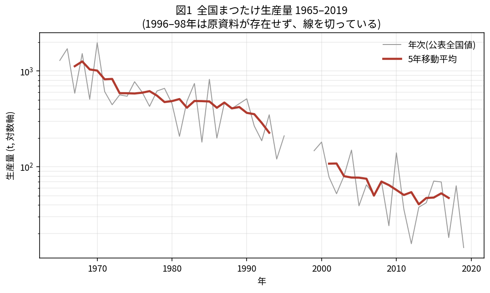
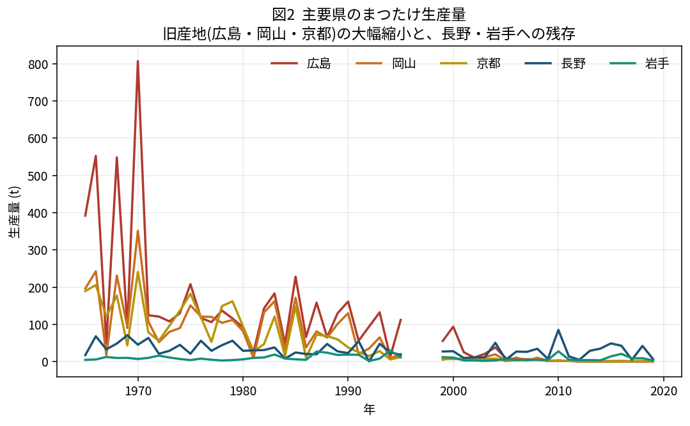
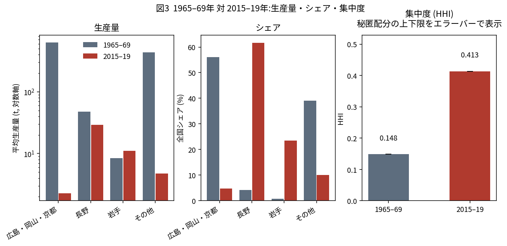

# 都道府県別特用林産物パネル 1965–2019

日本のマツタケ生産は 1970 年の 1,974 トンから 2019 年の 14.3 トンへ減少した。
本リポジトリは、その過程を都道府県単位で追える再現可能なパネルデータと、
それを用いて松くい虫（マツ材線虫病）の因果効果を推定しようとして
**成立しなかった**記録を公開するものである。

関連記事: `article/note_draft.md`

---

## 主な内容

### 1. 復元・監査済みパネル

農林水産省『特用林産基礎資料』由来の都道府県別生産量、**1965–2019 年**
（1996–98 年は原資料なし）。まつたけのほか、くり、くるみ、たけのこ、なめこ、
乾・生しいたけ、えのきたけ、竹材、まき、木炭を収録。

この統計は e-Stat では 2005 年以降しか電子化されておらず、国立国会図書館
デジタルコレクションの該当巻は館内限定である。本パネルは山梨県オープンデータ
カタログで再配布されていた年次 XLS 52 本から構築した。

原セルの読取値・補正前の数値・状態コード・単位・出典ファイル名を保持しており、
原 XLS と照合できる。

### 2. 記述的発見

| | 1965–69 年平均 | 2015–19 年平均 |
|---|---|---|
| 全国 | 1,124.6 t | 47.2 t |
| 広島・岡山・京都 | 629.9 t（56.0%） | 2.3 t（4.8%） |
| **長野** | **47.5 t（4.2%）** | **29.1 t（61.6%）** |
| 長野 + 岩手 | 56.0 t（5.0%） | 40.2 t（85.1%） |
| HHI（5 年平均） | 0.148 | 0.413 |







長野の絶対量は 47.5 t から 29.1 t へ**減っている**。シェアの上昇は長野の成長では
なく、旧産地の大幅縮小による**残存集中**である。

5 年間に一度でも実数で正値が確認された県は 38 → 21（統計法上の秘匿県を
含めれば 23）。2019 年の単年では実数公表 13 県 + 秘匿 4 県。

### 3. 識別の技術監査

松くい虫の県初確認年を用いた三重差分は成立しなかった。確認済み 8 県で
再構成した最終仕様（`code/04_matsutake_diagnostic.py`）でも、本命推定・
プラシーボの双方に事前差と対照品目依存が残る。加えて県初確認年は
県全体のアカマツ林曝露を表さない。

実装上の誤り 5 件とその影響を `docs/technical_note.md` に記録している。
誤った初期分析は削除せず `archive/invalid_initial_analysis/` に隔離した。

---

## ディレクトリ構成

```
data/raw/                原 XLS 52 本（山梨県オープンデータ経由）
data/processed/          整形済みパネルと QA テーブル
code/00_fetch_estat_timber.py  e-Stat から木材パネルを再取得（任意）
code/01_parse_tokuyo.py  原 XLS → パネル（1983 年の暫定補正を含む）
code/02_descriptives.py  図 3 枚と集計テーブル
code/03_firststage_timber.py  first-stage 診断（結果は「測れなかった」）
code/04_matsutake_diagnostic.py  まつたけ診断・最終仕様（効果推定には進まない）
docs/data_dictionary.md  全列と状態コードの定義（status は 9 種）
docs/technical_note.md   識別が成立しなかった経緯
docs/sources.md          出典・URL・閲覧日
data/raw/CHECKSUMS.md    原 XLS 52 本の SHA-256 と取得元
output/figures/          図 1–3
output/tables/           集計テーブル
output/firststage/       first-stage 診断の標本・係数・共分散・置換 360 通り
output/matsutake_diagnostic/  まつたけ診断（最終仕様）の標本・係数・置換
article/note_draft.md    記事本文
archive/invalid_initial_analysis/  誤った初期分析（使用不可・保存のみ）
```

---

## 再現手順

```bash
pip install -r requirements.txt
cd code
python 01_parse_tokuyo.py         # data/processed/ を再生成
python 02_descriptives.py         # output/figures/, output/tables/
python 03_firststage_timber.py    # output/firststage/
python 04_matsutake_diagnostic.py # output/matsutake_diagnostic/
```

`00_fetch_estat_timber.py` は任意。実行には e-Stat のアプリケーション ID
（環境変数 `ESTAT_APP_ID`）が必要。実行しなくても、同梱の
`data/processed/timber_pref_species_1960_2013.csv` から全解析を再現できる。

Python 3.10 以上。`01_parse_tokuyo.py` は `xlrd==2.0.*`（旧 `.xls` 読み込み）を
必要とする。図の日本語表示には CJK フォント（`Noto Sans CJK JP`、`IPAGothic`、
`Hiragino Sans`、`Yu Gothic` のいずれか）が必要。
`02_descriptives.py` はフォントが見つからない場合、豆腐のまま成功終了せず
エラー終了する。Debian/Ubuntu では `sudo apt-get install fonts-noto-cjk`。

---

## このデータを使う際の注意

### 使ってはいけない品目・期間

- **くり**: 1973 年（2,837 t → 470 t）と 1988 年（647 t → 36,850 t）に大きな
  尺度断層。遅くとも 2015 年時点では作物統計（果樹）由来。2010–13 年と
  2015–19 年の多くの年で、全国値が推計値のため県計と約 14–24% 乖離する。
  対照品目に使用不可
- **くるみ**: 1988 年に断層（100 t → 752 t）
- **なめこ**: 栽培品を含む。野生採取品ではないので「野生きのこの対照」として
  使うことはできない
- **まき**: 1976 年に単位変更（千束 → 層積 m³）。1985 年に単位ラベル不変のまま
  約 1,000 倍の断層。連続系列として扱えない
- **1983 年**: 複数品目で県セルの一部が公表値の 1/10 と整合的。暫定補正済みだが
  原典照合はしていない。主分析からは除外を推奨
- **2000 年以降の樹種別素材生産量**: 木材統計の調査方法変更により、あかまつ・
  ならが他樹種の 4 倍の下落幅を示す。1999 年以前と接続不可
- **2011 年以降の野生採取品**: 原子力災害対策特別措置法に基づく出荷制限が
  まつたけを含む野生きのこ類と山菜・原木しいたけを市町村 × 品目単位で規制。
  県レベルのパネル設計では処理できない

### ハイフンの扱い

原票の `-` は「ゼロ」と「その年は未調査」の両方を表す。判定は**列単位**で行う。
全国値が数値なら県のハイフンを分析上のゼロと分類し、全国値もハイフンなら
その品目は未観測とする。加算恒等式が成立する年ではこの解釈が支持される。
`status` 列に反映済み。詳細は `docs/data_dictionary.md`。

---

## ライセンス

- コード: MIT（`LICENSE`）
- データ: 原典の利用条件に従う。**必ず `DATA-LICENSE.md` を参照すること**

適用される利用規約:
- 山梨県オープンデータ利用規約 <https://www.pref.yamanashi.jp/opendata/kiyaku.html>
- e-Stat 利用規約 <https://www.e-stat.go.jp/terms-of-use>

出典 URL と閲覧日の一覧は `docs/sources.md`、原ファイルの SHA-256 は
`data/raw/CHECKSUMS.md` にある。

出典表示:

> 農林水産省「特用林産基礎資料」「農林水産省統計表」（山梨県オープンデータ
> カタログ経由）、農林水産省「木材統計調査」（e-Stat）。本リポジトリの作成者が
> 加工したものであり、加工内容について両省庁および山梨県は関与していない。

---

## 引用

Zenodo で DOI を発行した場合はここに追記する。
